# GitHub Actions Workflow Chain

## Overview

This project uses a **chained workflow approach** to ensure proper sequencing and prevent infinite loops.

## Workflow Execution Order

```mermaid
graph LR
    A[Push to main] --> B[CI Pipeline]
    B -->|✅ Success| C[Versioning]
    C -->|✅ Success| D[Deploy to Production]
    B -->|❌ Failure| E[Stop - No Deploy]
    C -->|Creates release commit| F[No CI retrigger]
```



## 1. CI Pipeline (`.github/workflows/ci.yml`)

**Trigger:** Push to `main` or `develop`, Pull Requests  
**Skip Condition:** Release commits (`chore(release):`)

### What It Does:
- ✅ Runs all unit tests (816 tests)
- ✅ TypeScript type checking
- ✅ Linting and code quality checks
- ✅ Security scanning (Trivy, npm audit)
- ✅ E2E tests (with seeded database)
- ✅ Code coverage reporting
- ✅ Mutation testing
- ✅ Container security scanning

### Success Criteria:
All tests pass, coverage meets threshold, no security vulnerabilities (high severity)

---

## 2. Versioning (`.github/workflows/version.yml`)

**Trigger:** `workflow_run` after CI Pipeline **succeeds**  
**Runs Only If:** CI Pipeline status = `success`

### What It Does:
- 📦 Runs `standard-version` to bump version
- 📝 Updates `CHANGELOG.md`
- 🏷️ Creates git tag (e.g., `v2.1.0`)
- 📤 Pushes version commit and tag
- ⏭️ **Does NOT trigger CI again** (commit message check)

### Skip Condition:
Last commit is already a release commit (`chore(release):`)

---

## 3. Deploy (`.github/workflows/deploy.yml`)

**Trigger:** `workflow_run` after Versioning **succeeds**  
**Runs Only If:** Versioning status = `success` OR manual trigger

### What It Does:
- 🏗️ Builds production Docker image
- 📤 Pushes to container registry
- 🚀 Deploys to production environment
- 🔍 Runs smoke tests
- 📊 Updates deployment status

### Manual Trigger:
Can be triggered manually with optional rollback SHA

---

## Anti-Loop Mechanisms

### ❌ **Problem:** Version commits trigger CI → triggers versioning → infinite loop

### ✅ **Solutions Implemented:**

1. **CI Skip on Release Commits**
   ```yaml
   # ci.yml
   if: "!contains(github.event.head_commit.message, 'chore(release):')"
   ```

2. **Version Commit Detection**
   ```yaml
   # version.yml
   if [[ "$LAST_COMMIT" =~ ^chore\(release\): ]]; then
     echo "skip=true"
   fi
   ```

3. **Workflow Dependency Chain**
   ```yaml
   # version.yml triggers on CI success
   on:
     workflow_run:
       workflows: ["CI Pipeline"]
       types: [completed]
   
   # deploy.yml triggers on versioning success
   on:
     workflow_run:
       workflows: ["Versioning"]
       types: [completed]
   ```

---

## Workflow Execution Examples

### ✅ Normal Push to Main

```
1. Developer pushes code to main
2. CI Pipeline runs (all tests)
   └─ ✅ Success
3. Versioning runs automatically
   └─ Creates v2.1.1, pushes tag
4. Deploy runs automatically
   └─ Deploys to production
```

### ✅ Version Commit Push

```
1. Versioning workflow pushes chore(release): 2.1.1
2. CI Pipeline SKIPS (detects release commit)
3. No infinite loop! ✅
```

### ❌ CI Failure

```
1. Developer pushes broken code
2. CI Pipeline runs
   └─ ❌ Failure (tests fail)
3. Versioning DOES NOT RUN
4. Deploy DOES NOT RUN
5. Production stays stable ✅
```

### 🔧 Manual Deployment

```
1. Navigate to Actions → Deploy
2. Click "Run workflow"
3. Optionally specify rollback SHA
4. Deploy runs immediately
```

---

## Additional Workflows

### SBOM Generation (`.github/workflows/sbom.yml`)
**Trigger:** Release published, tags, manual  
**Independent:** Does not block deployment

### Lighthouse (`.github/workflows/lighthouse.yml`)
**Trigger:** Pull requests, scheduled  
**Independent:** Performance monitoring only

---

## Best Practices

### ✅ **Do:**
- Let workflows run automatically
- Check CI before merging PRs
- Use manual deploy for hotfixes only
- Monitor workflow status in Actions tab

### ❌ **Don't:**
- Push directly to main without PR (bypasses checks)
- Manually run versioning (automatic is safer)
- Force push version commits
- Disable workflow skip conditions

---

## Troubleshooting

### Issue: Versioning not running after CI

**Check:**
1. Did CI succeed? (Green checkmark)
2. Was last commit a release commit?
3. Check Actions tab for workflow_run trigger

**Fix:**
```bash
# Manually trigger if needed
gh workflow run version.yml
```

### Issue: Deploy not running after versioning

**Check:**
1. Did versioning succeed?
2. Is production environment approved? (if required)
3. Check deploy workflow logs

**Fix:**
```bash
# Manual deploy
gh workflow run deploy.yml
```

### Issue: Infinite CI loop

**Check:**
1. CI skip condition present?
2. Release commit message format correct?

**Fix:**
Already implemented - should not occur with current setup!

---

## Monitoring Workflows

### GitHub Actions Tab
```
https://github.com/xavisavvy/toa-website/actions
```

### Workflow Status Badges
Add to README:
```markdown


```

---

## Related Files

- `.github/workflows/ci.yml` - Main test pipeline
- `.github/workflows/version.yml` - Automatic versioning
- `.github/workflows/deploy.yml` - Production deployment
- `.github/workflows/sbom.yml` - Security Bill of Materials
- `.github/workflows/lighthouse.yml` - Performance monitoring

---

**The chained workflow ensures:**
- ✅ No deployment without passing tests
- ✅ Automatic versioning after successful CI
- ✅ No infinite loops from version commits
- ✅ Clear dependency chain
- ✅ Production stability
